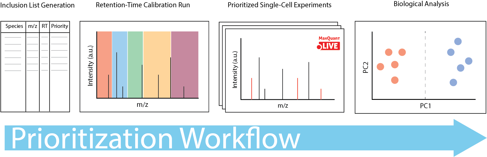

# **pSCoPE**

Prioritized Single-Cell ProtEomics by Mass Spectrometry

<!---->

* [Website](https://scp.slavovlab.net/pSCoPE)
* [Running](#running)
* [Download data](https://scp.slavovlab.net/Huffman_et_al_2022)
* [Preprint](https://www.biorxiv.org/content/10.1101/665307v3)

### License

The SCoPE2 code is distributed by an [MIT license](https://github.com/SlavovLab/DO-MS/blob/master/LICENSE).

### Contributing

Please feel free to contribute to this project by opening an issue or pull request.
